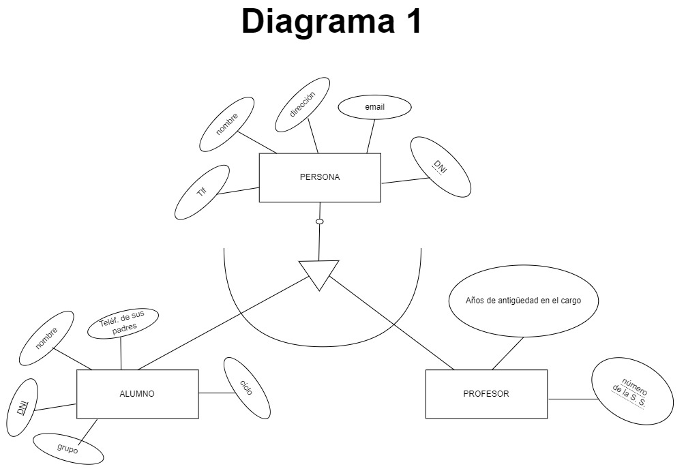
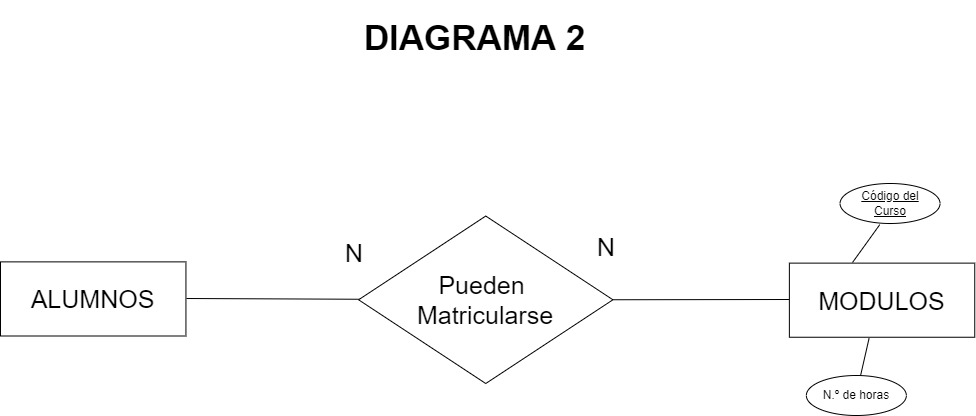
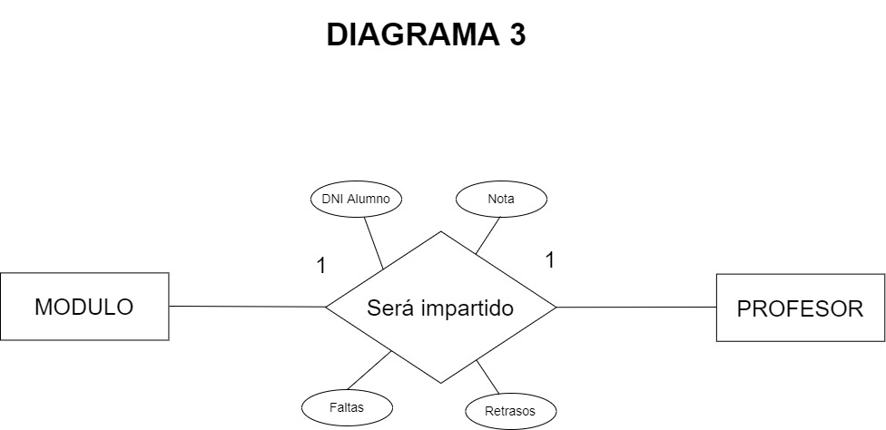
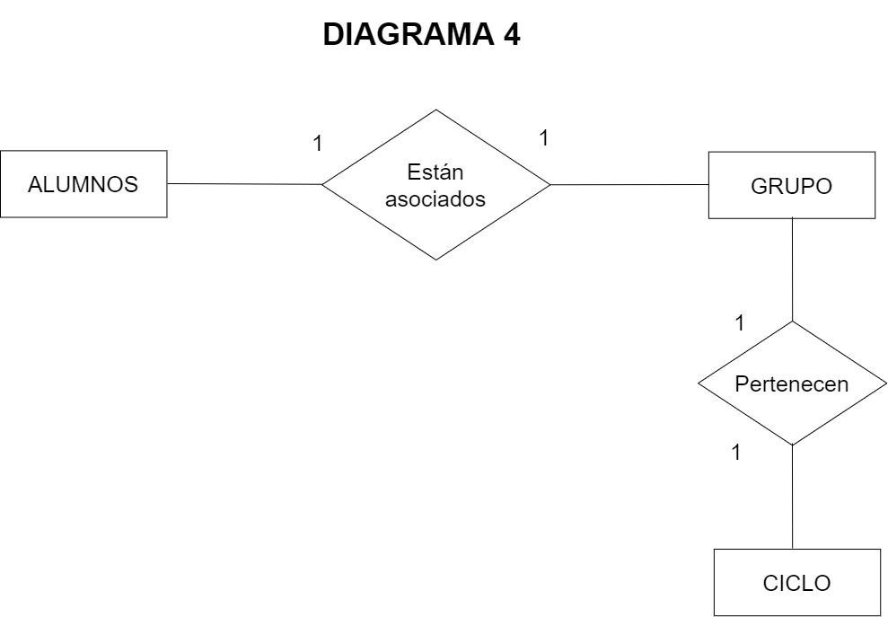
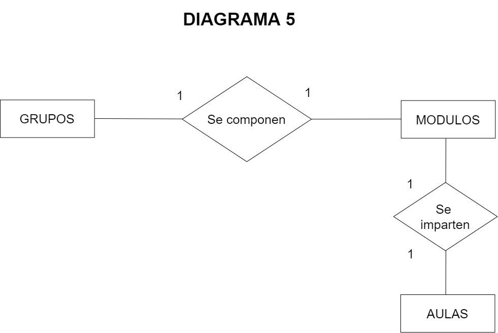
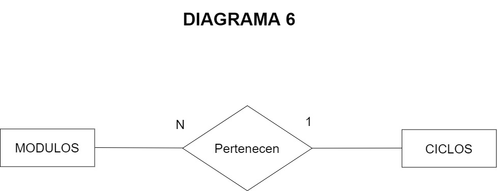
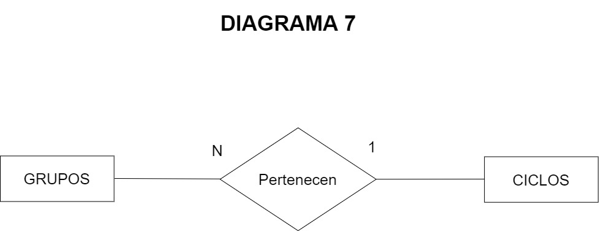
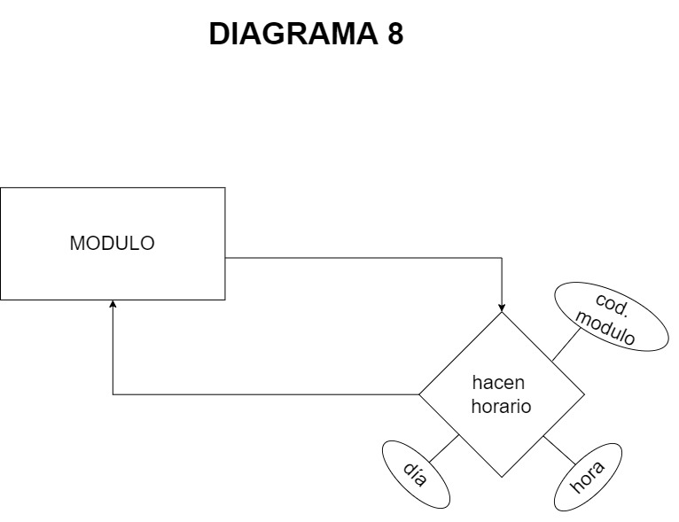
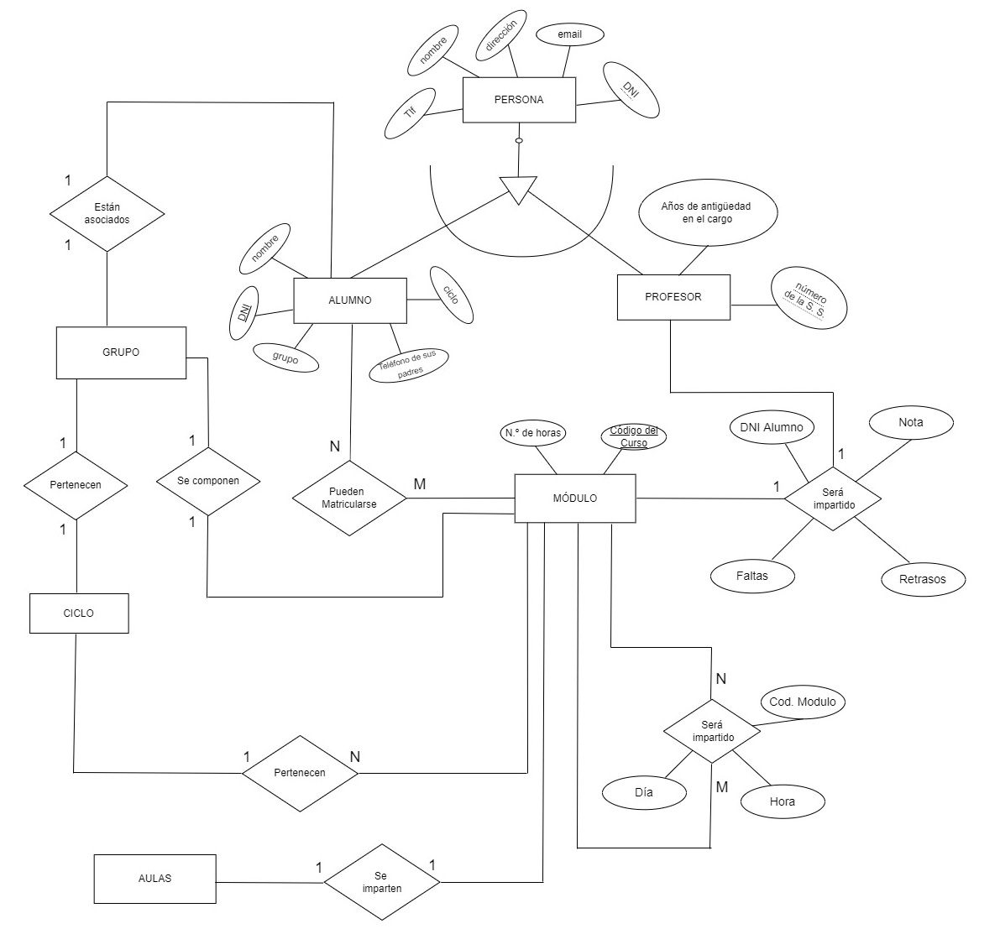

#Autor: Jose Maria Noriega Vazquez 

#E-mail: jmnoriegav01@iescastelar.com

#Diagrama 1

# Cuestionario de Preguntas
## 1. ¿Qué vamos a hacer?
La Práctica es crear un Diagrama Entidad Relación de un Instituto, donde hay Módulos, Grupos, Clases, Aulas, Alumnos y Profesores
## 2. ¿Con qué lo vamos a hacer?
Con la aplicación de draw.io
## 3. ¿Cómo se ha hecho?
El ejercicio consta de 9 partes, cada una en un diagrama distintos y depués esos diagramas se han unido en uno solo
## 4. ¿Para qué se ha hecho?
Para aprender y practicar hacer diagramas entidad Relación
## 5. ¿Donde se ha hecho?
Con el ordenador de casa
## 6. ¿Quién lo ha hecho?
Jose María Noriega
## 7. ¿Cuándo se ha hecho?
En un par de días

