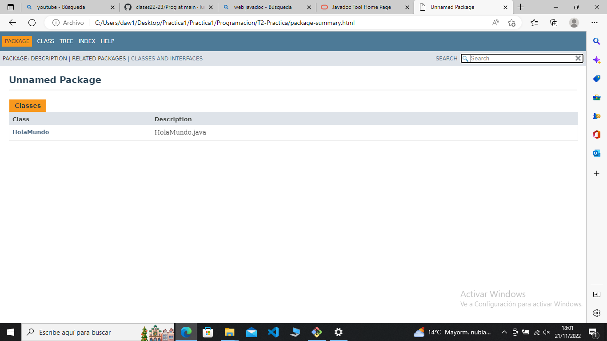
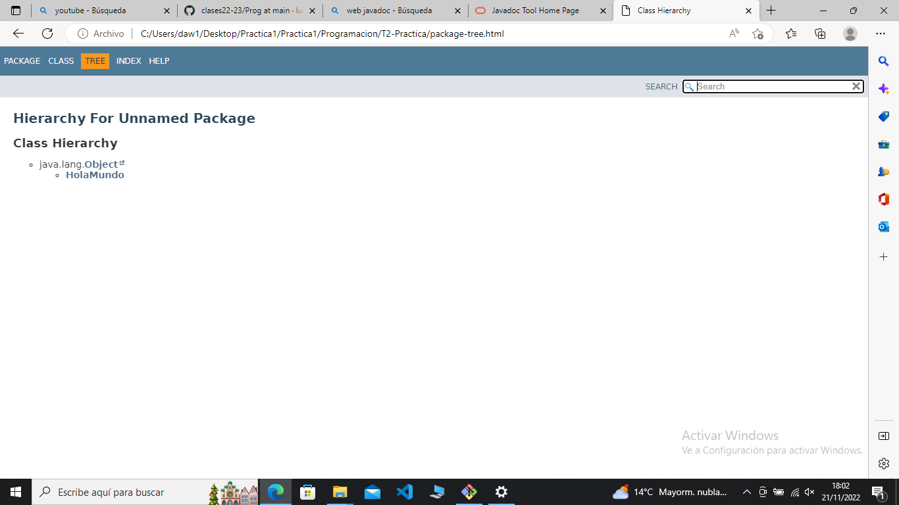
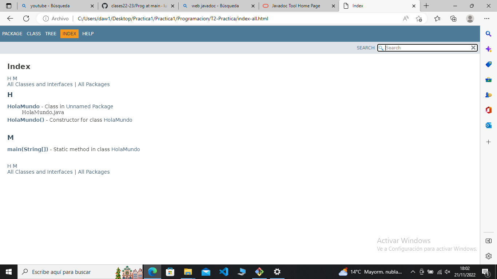

# Práctica 2 - JavaDoc

# Cuestionario de Preguntas

## 1. ¿Qué vamos a hacer?
Vamos a practicar con la herramienta JavaDoc, para ello hemos implementado la clase HolaMundo y con la herramienta JavaDoc la vamos a documentar.
             
## 2. ¿Con qué lo vamos a hacer?
Con la herramienta JavaDoc del JDS de Java

## 3. ¿Cómo se ha hecho?
    Primero, con el notepad++ hemos construido la Clase HolaMundo.java.

    Segundo, con el compilador de java hemos compilado la clase

                #javac HolaMundo.java

    Tercero, con la herramienta javaDoc hemos documentado la clase

                #javadoc HolaMundo

    La Herramienta nos ha generado una página web que la hemos consultado, en ella nos especifica sus métodos junto con sus atributos, esta clase solo tiene el método main.

## 4. ¿Para qué se ha hecho?
Para conocer la herramienta de documentación JavaDoc

## 5. ¿Donde se ha hecho?
En clase y en casa

## 6. ¿Quién lo ha hecho?
Jose María Noriega Vázquez

## 7. ¿Cuándo se ha hecho?
Cuando me he enterado de que había que hacer en la práctica la he hecho sin problemas, es una práctica muy sencilla.

## Captura 1

## Captura 2

## Captura 3

