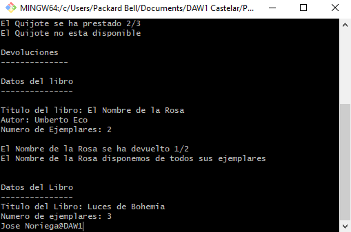
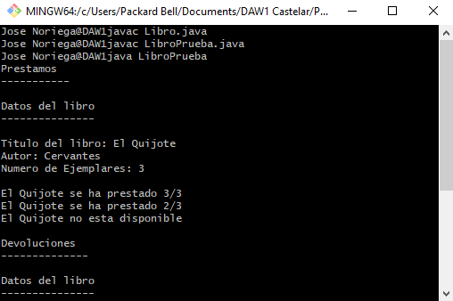

# Práctica 4 

# Cuestionario de Preguntas

## 1. ¿Qué vamos a hacer?
Vamos a realizar la Práctica número 4, que consiste en aprender a crear clases en JAVA, para ellos tenemos que crear una 
clase Libros:

  Atributos:
  ---------
       Título -> Título del libro 
       Autor -> Autor del Libro
       Números de Ejemplares -> Números de ejemplares disponibles que tenemos de un determinado libro 
       Números de Ejemplares Prestados -> Números de ejemplares que hemos prestados de determinado libro

  Métodos
  -------
        Libro() -> Constructor de la clase, que se encargará de inicializar todos los atributos.

        Libro(Titulo, Numeros de Ejemplares) -> Segundo constructor de la clase que tiene como parámetros el Título y el Número de Ejemplares.

        setTitulo(Titulo) -> método de la clase que se encarga de inicializar en atributo Titulo del Libro.

        setAutor(Autor) -> Métodos de la clase que se encarga de inicializar el atributo autor del Libro.

        setNumeroEjemplaresLibros(Número de Ejemplares de un Libro) -> Método de la clase que se encaraga de inicializar el número de ejemplares de un determinado libro.

        setNumeroEjemplaresPrestados(Número de Ejemplares prestados) -> Métodos de la clase que se encarga de inicializar el número de ejemplares prestados de una determinado libro

        getTitulo() -> Método de la clase que se encarga de devolver el titulo de un libro.

        getAutor() -> Método de la clase que se encarga de devolver el autor de un libro.

        getNumeroEjemplaresLibros() -> Método de la clase que se encarga de devolver en número de ejemplares de un determinado libro que hay en la biblioteca.

        getNumeroEjemplaresPrestados() -> Método de la clase que se encarga de devolver el número de ejemplares que hemos prestado de un determinado libro de la biblioteca.

        Prestamo() -> Método de la clase que se encarga de que cada vez que prestamos un libro, decremente el número de ejemplares prestados de ese libro, y devolviéndonos en el método una valor verdadero o falso en caso de que ya no podamos realizar más préstamos de una libros porque ya hemos prestados todos los ejemplares que tenemos disponibles en la biblioteca.

        Devolucion() -> Métodos de la clase que se encarga que cada vez que devolvamos un libro decrementar el número de ejemplares prestados, y devolviéndos un valor verdadero o falso en caso de que hayamos devuelto todos los ejemplares de un determinado libro a la biblioteca.
              
## 2. ¿Con qué lo vamos a hacer?
Lo vamos a hacer con el editor de textos Notepad++ y el jdk de java (javac para compilar y java para ejecutar la compilación).

## 3. ¿Cómo se ha hecho?

## 4. ¿Para qué se ha hecho?
Para aprender a realizar y a utilizar las clases en JAVA, como declarar sus atributos y como implementar sus constructores y sus métodos.  

## 5. ¿Donde se ha hecho?
En clase y en casa.

## 6. ¿Quién lo ha hecho?
Jose María Noriega

## 7. ¿Cuándo se ha hecho?
Le he dedicado un par de días, primero implementando la clase viendo que funciona correctamente y después realizando la práctica y junto con su documentación.

