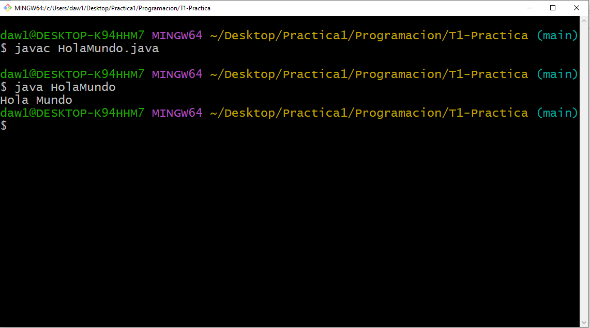

# Cuestionario de Preguntas
## 1. ¿Qué vamos a hacer?
La Práctica 1 consiste en crear una programa en JAVA que nos muestre por pantalla el mensaje "HOLA MUNDO"
## 2. ¿Con qué lo vamos a hacer?
Con el editor de texto notepad++
## 3. ¿Cómo se ha hecho?
Implementando la Clase Hola Mundo en JAVA
## 4. ¿Para qué se ha hecho?
Para crear nuestro primer programa en JABA
## 5. ¿Donde se ha hecho?
Las dudas las he resuelto en clase, y la práctica la he realizado con el ordenador de casa
## 6. ¿Quién lo ha hecho?
Un servidor, Jose María Noriega
## 7. ¿Cuándo se ha hecho?
Necesito dedicarle más tiempo a la asignatura y sobre todo a git que cojeo bastante en git, me desespero a veces.

